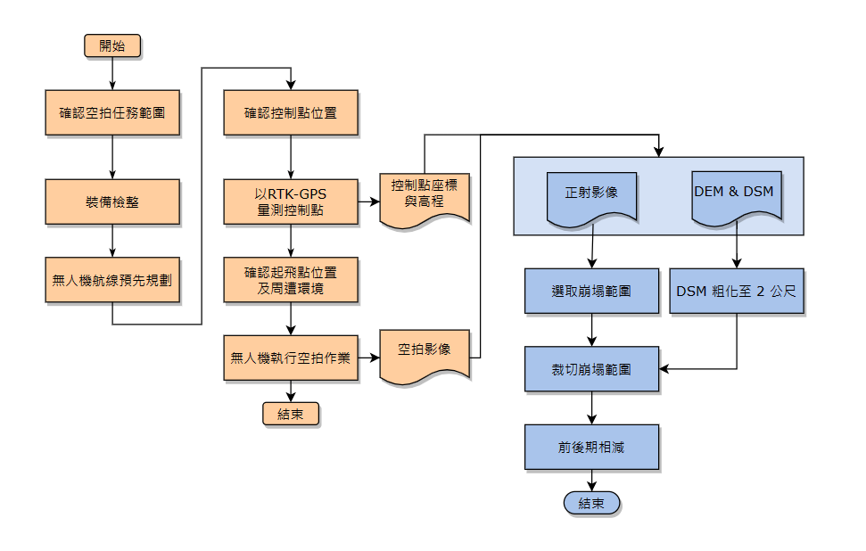

# landslide_volume
### Calculate landslide volume using DEMs

We took photos from a drone and turn them into a DEM.
By subtracting different peroids of DEMs, we get landslide volume.

FYI, we use ArcGIS Pro to resample all DEMs to 2m.

---
### Workflow

